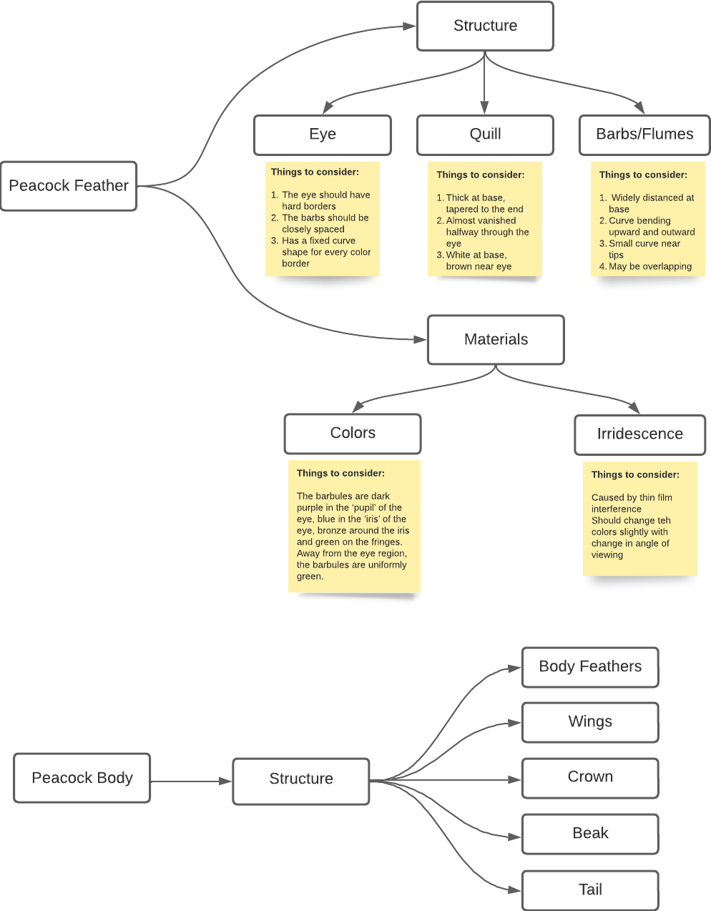

# Final Project CIS 566 - Houdini Peacock

## Design Doc

### Motivation

Peacock is one of the most beautiful and colorful birds. I have always been fascinated by the colorful patterns of its feathers, its regal crown, smooth, glossy body and joyful gait. It always reminds me of monsoon rains, petrichor and dancing in puddles. I had a fallen peacock feather that I used as a bookmark and would spend hours staring at. It brings back many folktales I've heard and poems I've read in my life. Hence I wanted to recreate this lovely bird for this project.

### Goal

I intend to get used to developing with Houdini. I want to create a peacock with its feathers spread out. I want to start with building a detailed peacock feather and if time permits, maybe even end with a complete peacock bird. Animating the peacock spreading its feathers can be future work after this project submission.

### Inspiration/reference

#### Peacock feathers

Artistic references:

Real photos:

---

#### Peacock Body (Possible future implementation)

Artistic references:

Real photos:

### Specification:
Main features of the project:
1. Building a detailed peacock feather render.
2. Working on the body of peacock with additional feathers (not detailed)

### Techniques:

I read through some of the following papers which helped me understand the structure of a peacock feather.

#### Papers
[The physical structure, optical mechanics and aesthetics of the peacock tail feathers](https://www.witpress.com/Secure/elibrary/papers/DN02/DN02043FU.pdf)
[An analysis of optimal structural features in the peacock tail feather](https://www.sciencedirect.com/science/article/abs/pii/S003039920500126X)

#### Video links
[Peacock spreading its feathers](https://www.youtube.com/watch?v=6wVWJIBsUFY)

#### Technical Breakdown of a feather:
The papers helped in understanding how a feather looks like in depth

#### Useful Houdini tools and tutorials:

I plan to start off with [this Houdini tutorial](https://www.youtube.com/watch?v=jNj9o9g04pA) for a basic feather design network. It samples points along a line(which will act as the stem or quill) and adds multiple curves (called barbs in a peacock feather) along the base line. I can then add tube geometry over all curves and merge it together.
To change it to look like a peacock I will have to perform the following operations:
1. Vary the sizes of barbs to give it a desired shape
2. Blending different colors to generate a color scheme along the axes
3. Maybe using a color mask to create the eye and set hard color borders
4. Sample points with varying distance along the quill
    - Base of the quill has loosely knit barbs or widely spaced out
    - The eye has tightly knit barbs or are very closely spaced
5. I will also have to change the irridescence in some way by using some material types
6. Maybe use of some function to vary the curls/bends of the quill within a small range.

Prima facie, I believe my work will involve a lot of the following Houdini base nodes and I will be extensively relying on their documentation:
- lsystem
- noise, scatter, copyToPoints
- geometry nodes (lines and primitives)
- transform, bend, orientation
- attribute wranglers, masks
- resample, remesh, sweep

### Design:

The following diagram shows the things I will have to consider as I build the feather. I have described the feather in detail and for future possible work also incuded basic components to consider when making the entire bird.

### Timeline:
- Milestone 1 - Detailed peacock feather generation
- Milestone 2 - Refining the eye and basic structure of peacock body with primitives
- Final submission - Tuning and adding additional details to the peacock for an aesthetic final render
