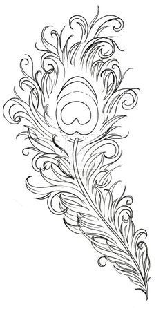
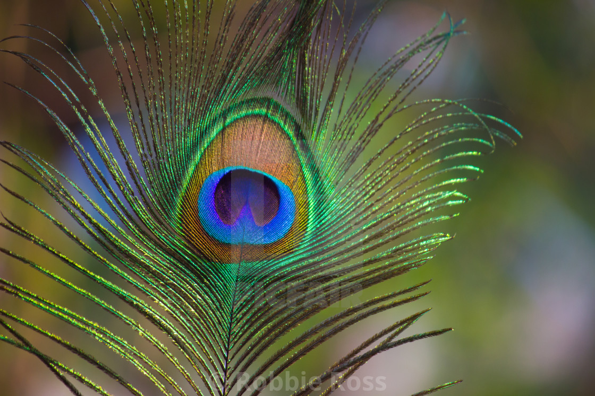
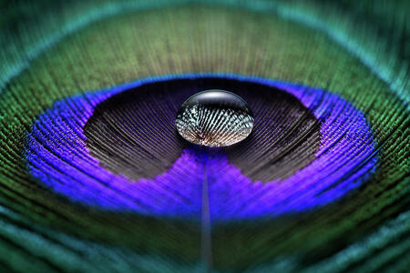
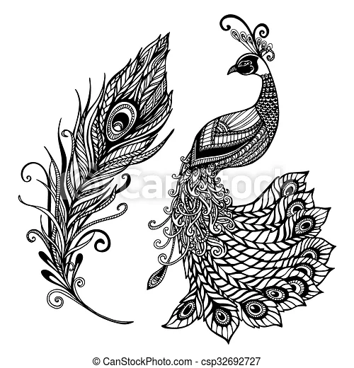
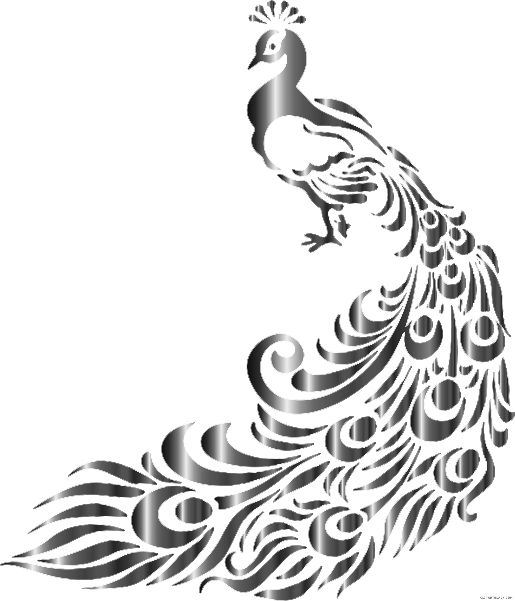
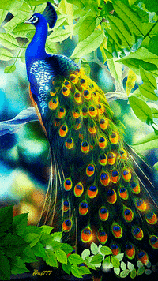
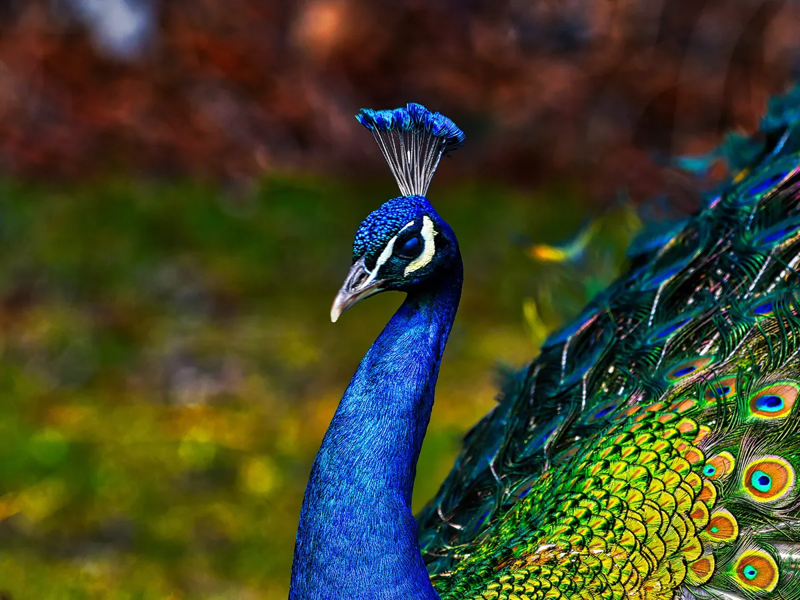
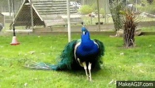
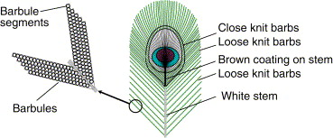

# Final Project CIS 566 - Houdini Peacock

## Design Doc

### Motivation

Peacock is one of the most beautiful and colorful birds. I have always been fascinated by the colorful patterns of its feathers, its regal crown, smooth, glossy body and joyful gait. It always reminds me of monsoon rains, petrichor and dancing in puddles. I had a fallen peacock feather that I used as a bookmark and would spend hours staring at. It brings back many folktales I've heard and poems I've read in my life. Hence I wanted to recreate this lovely bird for this project.

### Goal

I intend to get used to developing with Houdini. I want to create a peacock with its feathers spread out. I want to start with buillding a detailed peacock feather and end with a complete peacock bird. Animating the peacock spreading its feathers can be future work after this project submission.

### Inspiration/reference:

#### Peacock feathers

Artistic references:

Real photos:

#### Peacock Body

Artistic references:

Real photos:

#### Papers
[The physical structure, optical mechanics and aesthetics of the peacock tail feathers](https://www.witpress.com/Secure/elibrary/papers/DN02/DN02043FU.pdf)

[An analysis of optimal structural features in the peacock tail feather](https://www.sciencedirect.com/science/article/abs/pii/S003039920500126X)

#### Video links
[Peacock spreading its feathers](https://www.youtube.com/watch?v=6wVWJIBsUFY)

#### Specification:
Main features of the project:
1. Building a detailed peacock feather render.
2. Working on the body of peacock with additional feathers (not detailed)

#### Techniques:

Technical Breakdown of a feather:

Useful Houdini tools and tutorials:

- [Making a feather in Houdini](https://www.youtube.com/watch?v=jNj9o9g04pA)

My work will involve a lot of the following Houdini base nodes prima facie and I will be extensively relying on their documentation:
- lsystem
- noise, scatter, copyToPoints
- geometry nodes (lines and primitives)
- transform, bend, orientation
- attribute wranglers, masks
- resample, remesh, sweep

#### Design:
- How will your program fit together? Make a simple free-body diagram illustrating the pieces. (To be updated)

#### Timeline:
- Create a week-by-week set of milestones for each person in your group. Make sure you explicitly outline what each group member's duties will be.
- Milestone 1 - Detailed peacock feather generation
- Milestone 2 - Basic structure of peacock body with primitives
- Final submission - Tuning and adding additional details to the peacock for an aesthetic final render
