# Greeble Generator based on WebGL

Team: San Jewell and Yilin Liu

- [Video Demo](https://clipchamp.com/watch/Pm6bPs0cFJ6)

- [Live Demo](https://cis566-greeble-pyramid.netlify.app/)

## Final submission (due 12/5)
|
|:-------:|
Greeble Extrution Variations

|
|:-------:|
Various Rows & Columns 

We implemented a SDF-based greeble pyramid generator using WebGL. We handcrafted SDF for symbols 

|
|:-------:|
 UI Options: In "Greeble Control" folder, users can tweak parameters to adjust the greeble generations. In "Animation" folder, users can animate the camera to automatically pan around the pyramid.

| Symbol       | Image |
| ----------- | ----------- |
| Cross Symbol |        |
| Flake Symbol  |        |
| Line Symbol  |        |
| Circle Symbol  |        |
   

## Final features

It should be stated this was more of a engineering / code challenge rather than a overall beauty achieveing goal. It is modeled entirely with SDFs and frequently broke webGL (more on that later). The high-level project is an attempt to generate greebles of a certain theme. We ended up sticking with the triangles theme by using a pyramid of the base shape. The project can generate an interesting looking shape. It is more of a toy to enjoy messing with, and might be a cool asset to use in a game or cutscene. In general it can be adjusted in the following ways:

- The overall maximum extrusion depth of all of the triangles on the surface can be adjusted
- The depth multiplier below and above the surface can be independently adjusted. This allows concave and convex triangles or a mix of both.
- The scale of the triangles can be adjusted, so that small triangles or overlapping triangles can be achieved to control the amount of 'busyness' on the surface. 
- The number of triangles ('rows') can be adjusted. This will exponentially create a more complex looking surface. 
- There was a feature to adjust the number of symbols cut into each triangle, however this created loop-unrolling errors in some webGL implementations, so it is commented out and set to 1 for the purposes of the demo. 
- There were variables built in to 'animate' the randomness variables of the surface over time, however, this did not actually end up seeming very useful / good looking, so scrapped the idea. 

There is an animated camera which is useful for easily observing all of the randomness of the creation conveiniently. 

## Problems, rants, and scrapped features

The project, while not a complete dissappointment, involved a lot of dead ends. 

- There was some effort directed towards a third geometry element on the surface: "handlebar" components that could travel randomly from one triangle center to another without overlapping. However the math with regard to the SDFs ended up being much more complex in the context of how the other dimensions of the triangle face were arranged and needed to be scrapped
- There are a lot of performance problems to make the creator usable at a greater resolution especially with more rows. We only had the time to implement basic optimizations and so better demos were not created
- There was a desire to create a hybrid rendering system to trace both signed distance functions along with pre-generated signed distance fields. This would allow using mesh-based or vector based objects in the scene using a library such as https://pypi.org/project/mesh-to-sdf/ The reason that we wanted to do this was to use actual hieroglyph symbols available in unicode. **The vast majority of this project is completed**, unfortunately, due to an unfamiliarity with webGL, the pipeline for passing the fields was made around uniform vectors. For testing, this seemed to work when using a debugging field of size 8x8, however, as soon as the field was increased to a more realistic size, webGL broke, as it only allows a total number of 1024 uniform floats. After further research we found that this problem can be hacked around by using textures to pass in arrays, however, the boilerplate was so large that we ran out of time to make it realistic. You can see the sample pyramid render using the 8x8x8 field below, as well as the symbol shapes we were hoping to use.

Unicode Symbols         |  Can be easily imported into blender
:-------------------------:|:-------------------------:
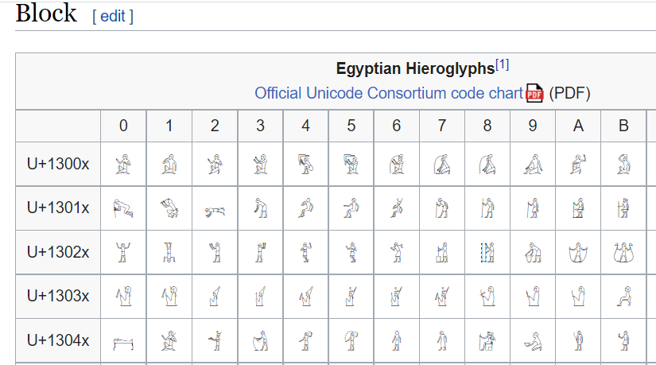  | 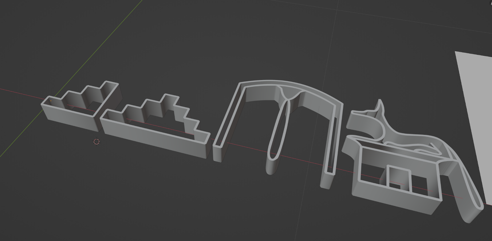

8x8x8 low resolution test field render         |  
:-------------------------:|
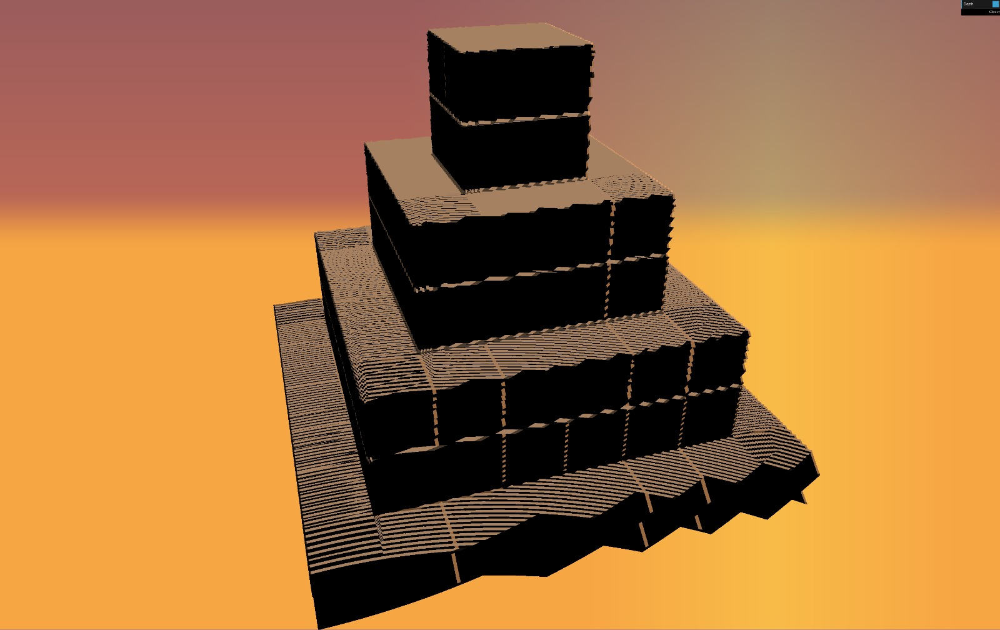  | 

## Design Doc

### Introduction
- I have always been interested in the lore, theocracy, language, and most importantly distinctive artic style of the civilization that thrived on the banks of the Nile Millenia ago: Ancient Egypt. I had a few ideas of how I might apply my interest in this theme in the realm of proceduralism. 

### Goal
- Design a greeble generator both:
 
	1) designed to work well on a few specific types of themed structure geometry. 
	2) consisting themselves at least partially of recognizable Egyptian themes. 

### Inspiration/reference:
- In reference to goal #1, these will probably have minimal or no procedural elements. Perhaps a few different base dimensions or heights, or if short on time, the buildings will be completely hand defined. Their shapes are usually relatively simple to model. See a few examples of common structures in this image. In the scope of this project I would probably start with the obelisk or pyramid shapes, possible exploring the larger temple styles if time permits.

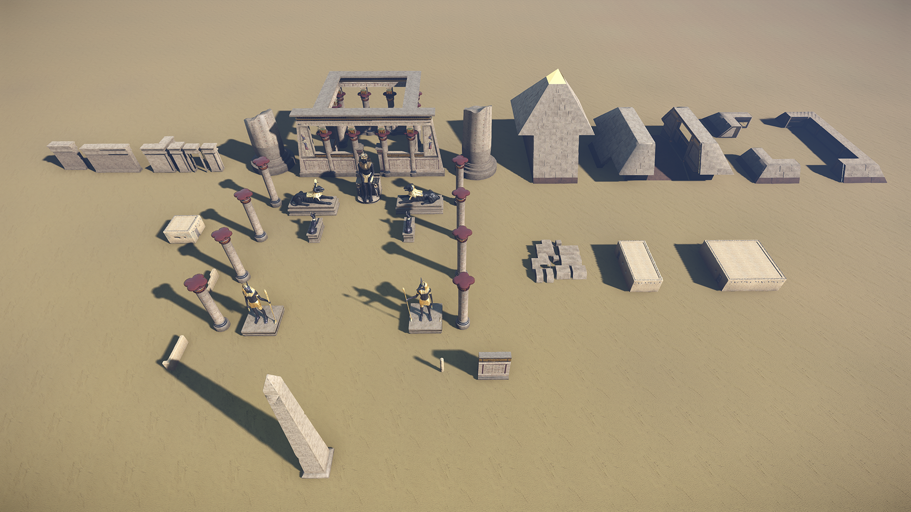

- The main goal is #2, that is, generating greebles to fit properly and look pleasant on the surfaces of these structures. I found a few inspiration images for this technique online. The first demonstrates height based greebles divided into a triangle mesh. The second demonstrates the possibility for building lighting on a themed structure.

| Reference 1      | Reference 2 |
| ----------- | ----------- |
| 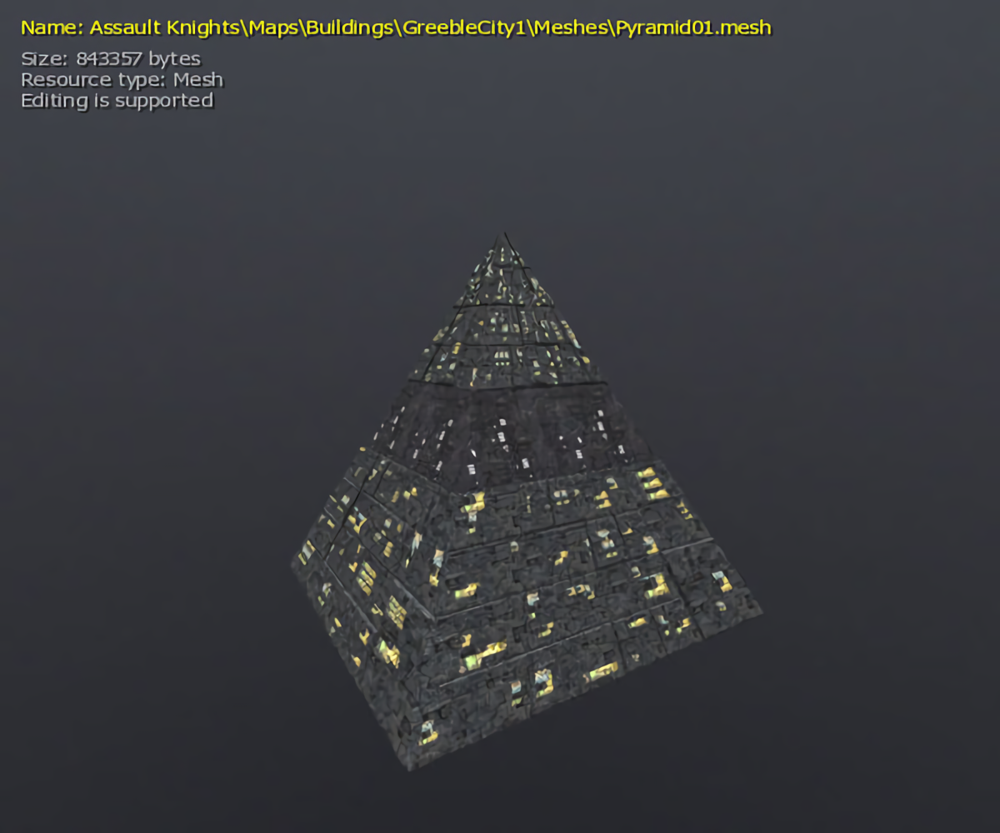      | 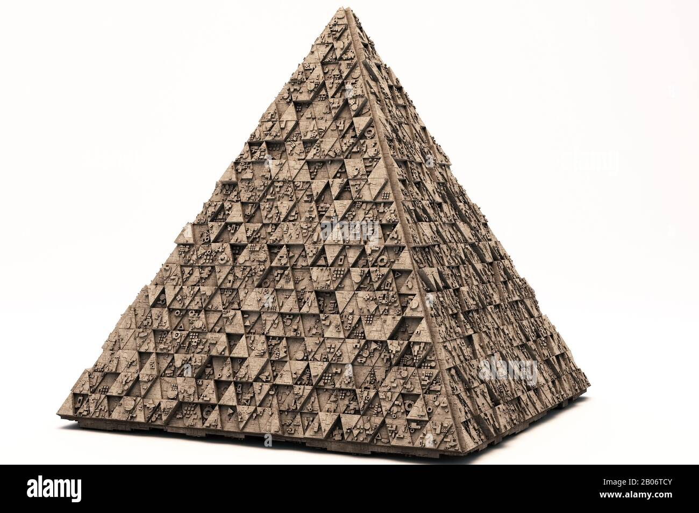       |
        

### Specification:
- For greebles
  - be able to select a surface partition type, square or triangle? 
  - be able to select a scale for the "noise"
  - be able to select some kind of mix ratio between generic geometric shapes (i.e. "star wars" greebles) and themed shapes, such as extruded hieroglyphs
- For structures
  - be able to choose from one or more pre-defined stereotypical building styles
  - (time permitting) be able to apply some kind of noise to generate variants of the chosen building shape

### Techniques:
- [Procedural Greeble Tutorial](https://lindenreidblog.com/2017/12/13/procedural-greeble-tutorial/) by [Linden Reid](https://lindenreidblog.com/)

In this tutorial, Linden introduces how he did the greeble effects. Put simply, to extrude a poly, we can create new verticies by translating the old verticies in the direction of the surface normal. 

For more realistic effects, we can add randomness to the extrusion scale and whether or not greeble is applied. 

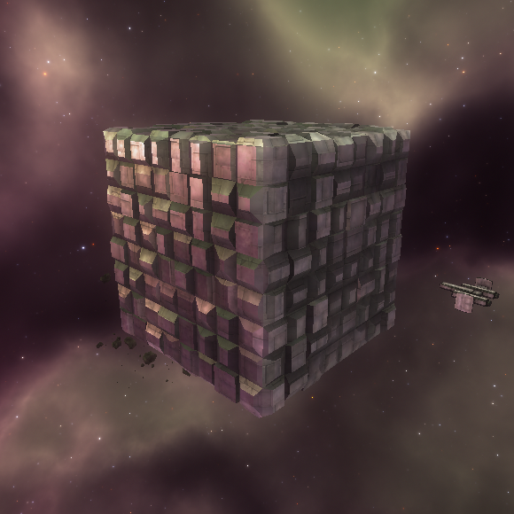

- [Voronoi Greeble Displacement: ShaderToy](https://www.shadertoy.com/view/NllyWf) by Shane

In this shadertoy, Shane used a tailored Voronoi algorithm to drive the generation of greeble displacement.  

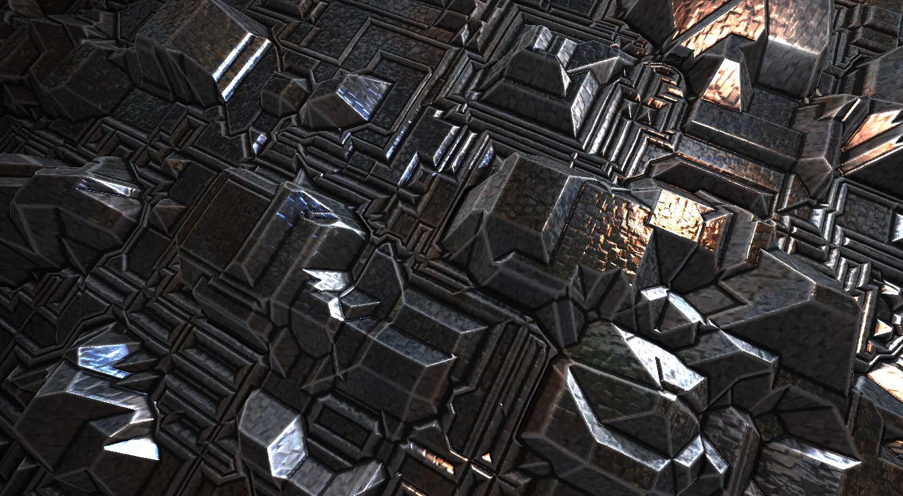

### Design:

The scene will consist of two main component, a background scene and a foreground geometry powered by greeble.

### Timeline:

|  | San Jewell | Yilin Liu |
| --------------- | --------------- | --------------- |
| Milestone 1, 11/16| General Greeble Generation & Initial structure design | General Greeble Generation & Initial structure design |
| Milestone 2, 11/28| Second level of symbol theming, GUI options | Procedural Background, GUI options |
| Milestone 3, 12/5 | Optimization & Demo Scene Design | Documentation write-up & Demo Scene Design |

Submit your Design doc as usual via pull request against this repository.

## Milestone 1: Implementation part 1 (due 11/16)

For Milestone1, we worked on a tesselation-based method to divide our pyramid but did not hit the goals. Therefore, we recently switched to the SDF-based method, which is more intuitive.
### DONE
- Implemented the extrusion through a SDF-based method. 
- Procedural sky with sun

### In Progress 
- The greeble Algorithm

### Screenshot
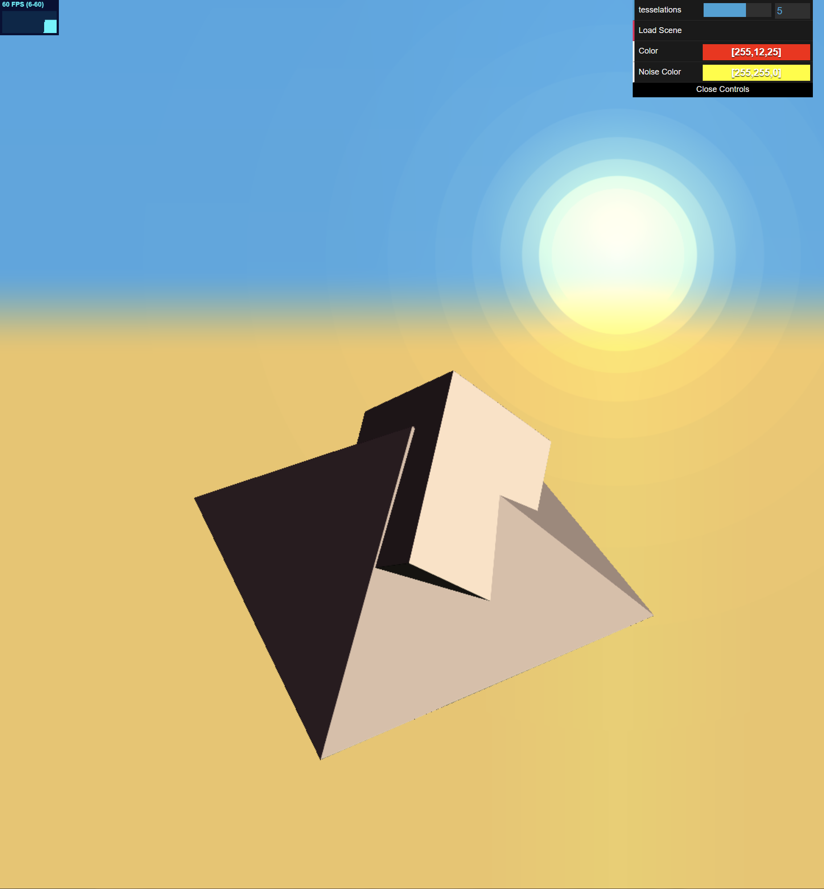

## Milestone 2: Implementation part 2 (due 11/28)

### DONE

- The greeble algorithm. 

### In Progress 

- GUI options
- Better visuals  

### Screenshot
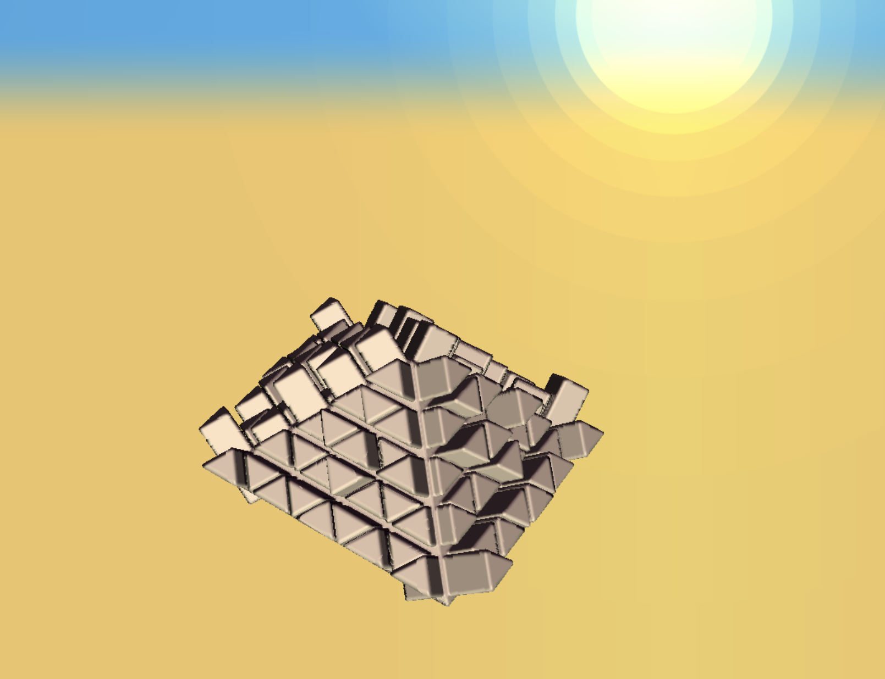

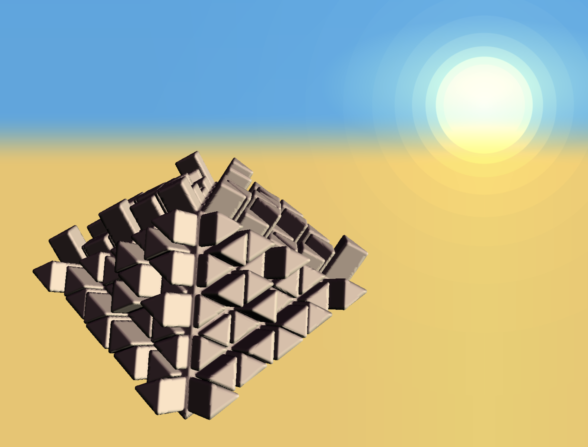

