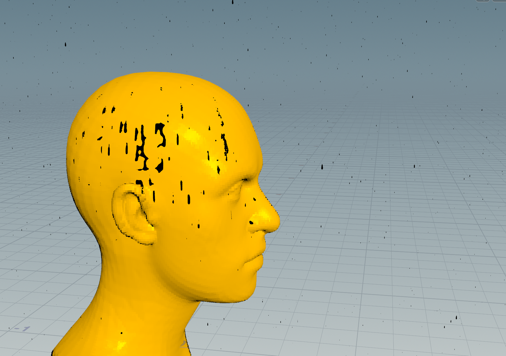
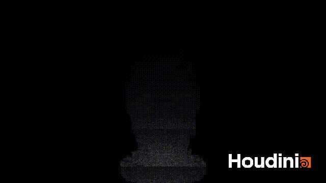

# Final Project!
I'll work with Yuqi Zhang and Dongying Liu for this final project. 

Here's the link of our design doc: https://docs.google.com/document/d/1Fy-YzTWK_csSgQDFjBJPMhLtHKCemdKlwvjb63kiVcI/edit?usp=sharing

## Milestone 1

### Wenqing Wang
| Pine tree model | Dense surface packing|
|--|--|
|||

In milestone 1, I learned the principle of Dense surface packing to complete a simple tree growth animation. I also modelled a pine tree based on our reference image. The current problem is that Houdini always crashes when I try to replace the low-poly tree shown in the gif result with my high resolution pine tree (I already pack and instance all the leaves when generating the pine tree). I considered that maybe the dense surface packing method is too computationally intensive for complex terrain or complex models, so in milestone 2 I plan to create a scatter number vs. time function to animate the growth of trees on the heightfield.

### Yuqi Zhang
Yuqi’s Milestone 1:
I finished the rain and snow particle generation, for the rain effect, I also worked with the interaction with the particle to geometry. (Rain drops stick on the geometry surface, accumulate to and drops)
I started working with lightning and got basic shapes. I am still working on the color/light of the lightning.

