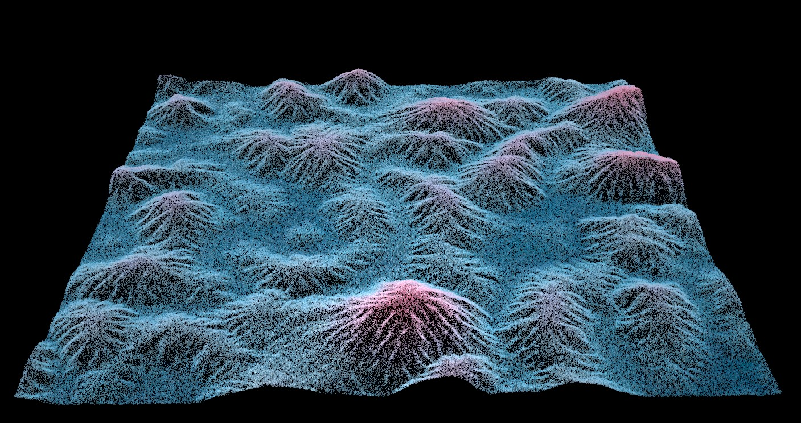
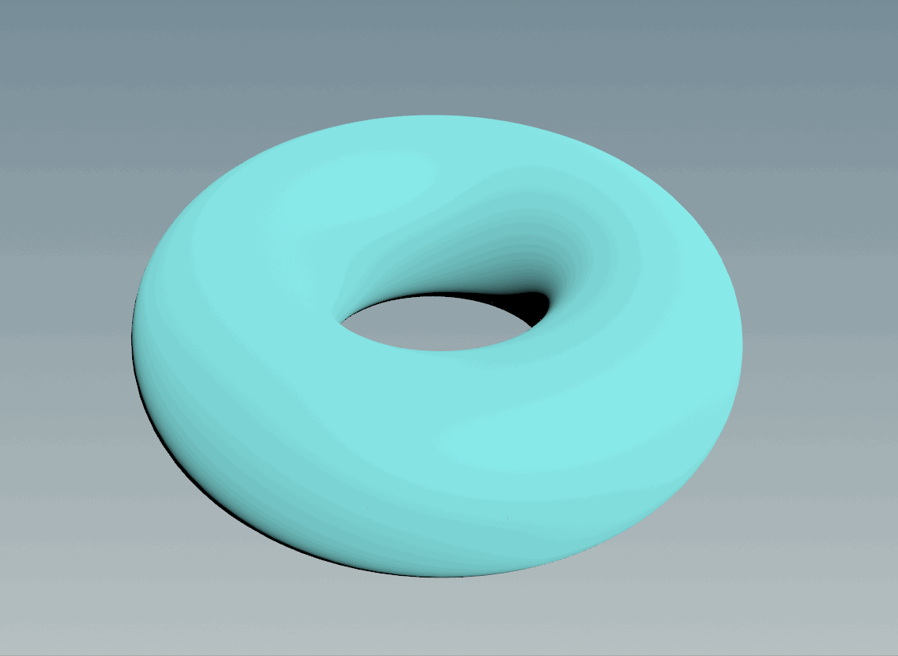

# CIS 566 final project - Wonderland

Please check out our final project video [here](https://drive.google.com/file/d/1AealpV6AoR4Fn9kUgliotcyZZVXKcarp/view?usp=share_link)

## Final Submission

### Features Overview

| Rain and Leave interaction | Snowing |
|---|---|
||

Rain drops falls on the leaves, accumulate and drop. Snow flyes in the air and accumulate on the trees. 

| Growth of the plants | Terrain movements |
|---|---|
||

| Snow Accumulation | Terrain |
|---|---|
||

### Procedural Snowflake
Initially, I used small spheres to build snowflakes, I created the particles movement system at first, then copy the small spheres to the particles to create snow. However, since our project has unrealistic style, the original snowflakes not fit this style. We discussed the shape of snowflake and finally come up with the procedural snowflake idea.
I recreated the snowflake by L-system, The snowflake could be customized by how many division it has. It could has four to six divisions. 

### Growth
In the last week, I first took the advice of the peer review meeting and created more unrealistic trees to better fit the style of our terrain. I used Houdini's Quick Tree Tool to create the basic shape of the tree by drawing curves. Then, inspired by some tutorials online, I reshape and distribute the leaves to give the tree a more stylized look.
| Basic tree | Stylized tree |
|--|--|
|||
|||
|||

For the growth simulation part, I mainly followed the method I used in milestone 2. To make the growth animation looks more natural, I painted different masks for each type of tree and removed the noise node so that the spreading is strictly confined to the specified areas. This allowed us to achieve the goal of matching the color of the leaves to the terrain to a certain extent. 

| Growth simulation |
|-|
||

| Frame 40 | Frame 80 | Frame 120 |
|---|---|---|
| | | |

One thing worth mentioning is that at first, I wanted to dynamically set the color of the leaves by getting the color of the scatters points which inherited the terrain color. The results looked exactly what I wanted in the scene view but incorrect in the render view. I was stuck here for a long time, trying different ways to fix this. Finally, I found it was caused by the "pack and instance" option in the copy to points node. When I unchecked this option, everything turned out to be correct in the render view. Unfortunately, it then made my Houdini super slow and crashed frequently which means I had to abandon this approach and find an alternative.
Performance was always a top concern during my development, especially when I started merging with the flowing terrain part, I found that computing a single frame of simulation took much longer (3-5 minutes) than we had expected, making it almost impossible for us to render a more than 1-minute animation in the end. To this end, I have taken many measures to reduce the computing load. Firstly, I optimized the distribution method of trees on the terrain. I restricted the scattered area based on the previously made growth path mask and density attribute (Dongying adds density attribute to the terrain according to the altitude), reducing the number of required distribution points by **10-20 times**. In addition, when importing Dongying's finished terrain, in order to avoid recalculating the terrain every frame, we used the cached results to reference each other's work, which greatly reduced the calculation time. Lastly, since I found an alternative to match the leaf's color to the terrain, I was able to use pack and instance for both leaves generation as well as spreading trees across the terrain, which saved a lot of resource load time.

| File cache Example| 
|-|
||

After a series of performance optimizations, the final render time has been reduced from 3-5 minutes to 3-5 seconds per frame, which is nearly **60 times** faster.

### Fluid Terrain
#### Terrain Texture Generation
After creating our terrain with heightfeild, I use the cop2net node to create the texture for our terrain with all the mask and data generated with Heightfield. The base color was create from height attribute of the heightfield and ramp the color with height. I used flow mask to emphasize the flow color, and use ao and edge and random noise to add some details to our terrain texture as well.
After creating the texture, I use attribfrommap node to project the texture to our terrain.
| Base Color - Height | Flow Detail - Flow Mask | Details Added |
|----|----|----|
||||

#### Grass
To make the terrain looks fluffy with grass. I add normal to terrain and use hairgen to create grass for the terrain. Adding some bend and randomness to it as well. One thing important for grass generation is how detailed is the grass land. Because we don't need the details for grass, I resample each grass so that it only has two points to keep the total points number of the grass land relatively low.
After create UV for the grass land, I used the same texture for the terrain to create color attribute for it.
| Grass | Terrain With Grass | 
|---|---|
|||

#### Integration
One important part for our project is integration. As terrain is the main part for most of the scene of our project, I output my terrain and grass as file cached so my teammates can grab what they want for their features. And I used their output cached file as well to finished the fluid terrain. 

## Post Mortem

### How did your project go overall? 
Overall, the project goes well, the combination between all the components works well.  The movement of the ground, the growth of the plants, the weather system. We finished three parts separately and finally merged and dealt with the interaction between different parts together.

### Did you accomplish your goal? 
Yes, the initial goal of this project was to combine terrain, plants and weather together. Let those three factors interact closely. The terrain and the weather changes may have different effects on the plants. According to our design doc, the goal was “ Rendering a short film in the 30-40s, reflecting the impact of natural climate and geological changes on the growth of plants.”

In our final accomplishment, we not only show those three parts beautifully individually, but also deal with the interaction between the three parts naturally. We are all very satisfied by our final result.   

### Did you have to pivot?
Fortunatly, we do not need to pivot for our project. We seperate our work clearly at the beginning and integrate in the early stage to make sure we have everything we need to finished out project.

# Milestone 2

## Weather
### Yuqi Zhang
For milestone 2, I finished most part of different weathers, I still getting bugs on thunders and lightning part. 
The Cloud will be used in sunny weather and raining/snowy weather. The color(shadow) of the cloud will change based on the timeframe. 
There are also be different layers of cloud, I finished two layers, the cloud on the top layer will be lighter and move fast. But rendering one frame of cloud takes about 40 minutes, so I didn't include the gif of the cloud. 
| Cloud | Cloud with sample scene|
|--|--|
|||

For the interaction part, I finished the accumulated snow on the simple tree. The interaction between objects and snow only has the relationship of accumulation. The interaction between rain and objects may be more complicated. The rain drops may accumulate, sliding, sticking on the surface of the objects. 

| Snow interactions | 
|--|
||

In the next week, I will work with my teammate to merge this part. I will work with the interaction of snow and rain on the terrain and plants that my teammates implemented. I did not find a good way to transit weathers for now, I will work on that before the final. If I cannot find a good way to transit, I may use keyframe to present different weathers.  The transit between different seasons and weather may also be a challenge for me. I will also work on the weather cycle to make the change of weather as smooth as possible. 

## Fluid Landscape and Growth

### Dongying Liu - Fluid Landscape
After figuring out how to transfer the motion of flip particles to heightfield, I tried to create a better looked terrain and drive it with a spiral particle motion.

#### Pyro Smoke and Flip Particle Simulation
I want to create a spiral particle simulation. Inspired by [this tutorial](https://lesterbanks.com/2018/10/create-mix-colors-houdini-fluids/)
, I tried to create a smoke and use the motion of the smoke to drive the paritcles' movement. The smoke is created with pyro solver. The particle is simulated with flip solver. I use the velocity of the smoke as wind direction, and use wind to affect the particles' movement.
| Smoke Simulation | Flip Particle Simulation Drive By Smoke |
|--|--|
|||

#### HeightField Terrain
Inspired by [this tutorial](https://www.youtube.com/watch?v=X0Bgl-HjW8k). I simply created the terrain with heightfield.

#### Transfer Flip Particle Motion To HeightField
Although I've spend a lot of time and tried a lot of ways to transfer the flip particle motion to heightfield. When I finally figured this out, it turns out that it was really not that difficult... Flip simulation is created base on volume, it will output a velocity field itself. So, I can use the velocity field of the flip particle simuation to drive the heightfield. After convert the heightfield to polygon, I sample the velocity field with point position and use the solver to do p+=vt to create the movement of the terrain.

### Wenqing Wang - Growth simulation on heightfield

Since the method, I used for simulation growth on the surface is somehow computationally heavy and would crash my laptop if using more complicated geometries, I tried another way to implement growth simulation in milestone 2. I first tested it on a 10 x 10 grid with a simple noised applied to it, and it looks good with my pine tree growing on it. In order to merge my simulation with Dongying's terrain motion, I then started working on heightfield. 
The basic settings for my growth are simple. First, I selected a start area with the scattered point on the heightfield for the growth simulation. Then I paint the attribute on the converted heightfield to create the growth path.
| Start point | growth path |
|--|--|
|||

In this phase, I use the color attribute to visualize the expansion of the growth area. I also add a wave at the outer edge to add some motion to the simulation.

| growth area | growth wave |
|--|--|
|||

And below is the final result:
| Pine tree growth simulation on heightfield |
|-|
||

During this milestone, I also started to merge with Dongying's work. Before merging our code, one of my concerns was whether the positions of the trees growing based on the height field would move with them when the terrain started to have some motion. Fortunately, I found that this could be solved by simply replacing the original scatter node with the heightfield scatter node.

The biggest problem we faced so far was the hardware and software limitations. Although we have a GTX 3060 graphics card, we can only use the free version of Houdini and its own CPU-based renderer, so our simulation and rendering in Houdini are super slow. The situation seems to get even worse considering Dongying wants to create more complex terrain and I plan to add other high-resolution assets from Quixel Bridge (i.e. grass, flowers, etc) and create unique growth paths and animations for each (we haven't even merged Yuqi's work yet).

Maybe buying Houdini's commercial version + subscription to Redshift would be a solution, but for now, we are still considering if there is a more affordable solution.

# Milestone 1

### Wenqing Wang
| Dense surface packing | Pine tree model |
|--|--|
|||

In milestone 1, I learned the principle of Dense surface packing to complete a simple tree growth animation. I also modelled a pine tree based on our reference image. The current problem is that Houdini always crashes when I try to replace the low-poly tree shown in the gif result with my high resolution pine tree (I already pack and instance all the leaves when generating the pine tree). I considered that maybe the dense surface packing method is too computationally intensive for complex terrain or complex models, so in milestone 2 I plan to create a scatter number vs. time function to animate the growth of trees on the heightfield.

### Yuqi Zhang
Yuqi’s Milestone 1:  
 

I finished the rain and snow particle generation, for the rain effect, I also worked with the interaction with the particle to geometry. (Rain drops stick on the geometry surface, accumulate to and drops)  
I started working with lightning and got basic shapes. I am still working on the color/light of the lightning.  
I also need more knowledge of rendering in houdini. I assigned the material to the geometry and rain drops, but I did not render the effect I wanted. I may also need to spend some time learning that.   
In milestone 2, I need to keep working on the weathers and maybe also need to think about how to represent them. For example, I want to exhibit the wind by moving plants. I may need to observe how they move. What is more, I also need to keep working with the sound, the thunder and lightning always happen together, also I need to add some rain sound to make sure they combine perfectly. 

### Dongying Liu

| Terrian Motion With Random Vel | Flip Tank Particle | Terrian Motion With Particle Vel |
|--|--|--|
||||

For milestone 1, my goal is to create a fluid terrain. My first thought was to create a terrain and give every point of the terrain velocity. So, with the Solver node, I can do p+=vt to every point to make the terrain move. 

As the picture shows above, I create a velocity field with Volume Node, and the velocity is generated by noise. And then I sample the velocity field with the position of every point of the terrain to give the point a velocity. As the picture shows, the terrain moved. 

According to the reference, the author said he transfered the flip tank particle motion to heightfield. So, I created a simple flip tank particle effect and then used the particle velocity to create a velocity field volume. However, the reulst seems not correct, it might be the problem that the velocity field has more y direction's velocity. So, the terrian move upward rather than moved on xz plane. 

## Design Doc
Here's the link of our design doc: https://docs.google.com/document/d/1Fy-YzTWK_csSgQDFjBJPMhLtHKCemdKlwvjb63kiVcI/edit?usp=sharing
