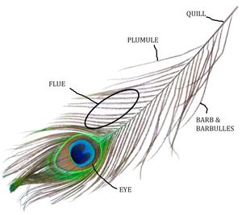

# Final Project CIS 566
Find a quick [video of making and demo here](https://drive.google.com/file/d/1E5Ascchzc6NvScllslJxYXp_-zhpFCp1/view?usp=sharing)

## Motivation

Peacock is one of the most beautiful and colorful birds. I have always been fascinated by the colorful patterns of its feathers, its regal crown, smooth, glossy body and joyful gait. It always reminds me of monsoon rains, petrichor and dancing in puddles. I had a fallen peacock feather that I used as a bookmark and would spend hours staring at. It brings back many folktales I've heard and poems I've read in my life. Hence I wanted to recreate this lovely bird for this project.

## Goal

I intend to get used to developing with Houdini. I want to create a peacock with its feathers spread out. I want to start with building a detailed peacock feather and if time permits, maybe even end with a complete peacock bird. Animating the peacock spreading its feathers can be future work after this project submission.

## Inspiration/Reference

### Peacock feathers

**Artistic references:**

**Real photos:**

---

### Peacock Body (Possible future implementation)

**Artistic references:**

**Real photos:**

## Specification:
Main features of the project:
1. Building a detailed peacock feather render.
2. Working on the body of peacock with additional feathers (not detailed)

Prima facie, I believe my work will involve a lot of the following Houdini base nodes and I will be extensively relying on their documentation:
- lsystem
- noise, scatter, copyToPoints
- geometry nodes (lines and primitives)
- transform, bend, orientation
- attribute wranglers, masks
- resample, remesh, sweep

## Techniques:

I read through some of the following papers which helped me understand the structure of a peacock feather.

### Papers
[The physical structure, optical mechanics and aesthetics of the peacock tail feathers](https://www.witpress.com/Secure/elibrary/papers/DN02/DN02043FU.pdf)

[An analysis of optimal structural features in the peacock tail feather](https://www.sciencedirect.com/science/article/abs/pii/S003039920500126X)

### Video links
[Peacock spreading its feathers](https://www.youtube.com/watch?v=6wVWJIBsUFY)

### Technical Breakdown of a feather:
The papers helped in understanding how a feather looks like in depth

---

### Useful Houdini tools and tutorials:

I plan to start off with [this Houdini tutorial](https://www.youtube.com/watch?v=jNj9o9g04pA) for a basic feather design network. It samples points along a line(which will act as the stem or quill) and adds multiple curves (called barbs in a peacock feather) along the base line. I can then add tube geometry over all curves and merge it together.
To change it to look like a peacock I will have to perform the following operations:
1. Vary the sizes of barbs to give it a desired shape
2. Blending different colors to generate a color scheme along the axes
3. Maybe using a color mask to create the eye and set hard color borders
4. Sample points with varying distance along the quill
    - Base of the quill has loosely knit barbs or widely spaced out
    - The eye has tightly knit barbs or are very closely spaced
5. I will also have to change the irridescence in some way by using some material types
6. Maybe use of some function to vary the curls/bends of the quill within a small range.

## Design:

The following diagram shows the things I will have to consider as I build the feather. I have described the feather in detail and for future possible work also incuded basic components to consider when making the entire bird.

## Timeline:
- Milestone 1 - Detailed peacock feather generation
- Milestone 2 - Refining the eye and basic structure of peacock body with primitives
- Final submission - Tuning and adding additional details to the peacock for an aesthetic final render

---

# Milestone 1 - Peacock feather

## Structure

I followed the Houdini feather tutorial referred above for a basic feather and the tweaked it to make it look like a peacock feather.
I start off with a line for the main stalk and applied a distance based mask along it. I then used an attribute wrangler to get a density attribute based on the mask and distance from base of the stalk. Using Houdini's `Labs Curve Resample By Density` node, I was able to resample the line and scatter points along the line with varying density.

|Line density mask|Low density sampling|High density sampling|
|---|---|---|
||||

I took another line and bent it to generate a single barb curve. After using some noise to update the normal at each point on stalk, I copied all barbs along the stalk and mirrored it. I used distance along geometry again to remap the length of each barb to obtain a peacock feather shape. I also ruffled the barbs and their orientation with noise function.

|Single barb curve|Barbs along stalk|Remaping length and mirror|
|---|---|---|
||||

The barbs are distributed to ensure that they are spaced far away near the base of the stalk and very tightly near the eye. All lines are then given round tube geometry with radius along the length.

## Color

For the colors I have mostly referred to the following color palette:  

The stalk is colored white at its base and brown at its tip (at base of the eye). For the feather colors, I used two `Adjust color attribute` nodes to vary colors along X and Z axis respectively (The feather is placed in XZ plane).

|Stalk coloring|Colors along X|Colors along Z|Blended  feather|
|---|---|---|---|
|||||

Finally I used some 2D SDFs combinations to create colors of the eye.

|Eye colors|Eye positioning|
|---|---|
|||

The final feather I generated for this milestone looks as follows after adding a slight bend.

# Milestone 2 - Iridescence and shape

For this milestone I worked on 2 main things - correcting the shape of my feather and trying to get iridescence working. I also worked on trying to set a path for the camera and feather to follow and animate, but it is stilll work in progress

## Feather shape

I realised after comparing with reference that my barbs curve seemed to be incorrectly bent. So I corrected that by rotating the barb before attaching it to the stalk and it improved the look a lot.

|Old barb curve|New barb curve|
|---|---|
|||

After a critique session with Rachel I updated the following things:
- Pushed the eye higher
- Made the feather shape around the eye rounder and more suited to look like a feather. I used 2D sdf again to get the shape right and then added some noise to scale the barbs

My reformed feather structure looks as follows:  

## Iridescence

I used the following cosine color palette to get iridescence colors:  

| Iridescence color reference | Iridescence color pallette |
|---|---|
|||

|a|b|c|d|
|---|---|---|---|
|(0.500 0.500 0.500) | (0.500 0.500 0.500) | (0.718 0.988 1.000) | (-0.222 0.448 0.898) |

The following figure shows what the iridescence colors look like from different views:   

---
### Top View
Notice the purple/pink very prominent at tips and the middle where the barbs curve in   

---

### Side Views

In the following images you can observe the changing green and yellow shades and compare it with the look from top view.   
   

I multiplied the color directly with the feather color and it shows the following look   

**I do not like the idea of multiplying it. In my next milestone I will try to set this color as a specular/sheen color in the material assigned to my feather.**

## Camera animation

I tried adding camera and feather animation but I am not satisfied with the renders. I still need to work on lighting to get the renders right.   

# Final submission:

   
   

**Iridescence bloopers:**

I initially started off by following the following think film shader turorials and shadertoy example which calculated iridescent colors using complex wavelength functions or using noise functions and I was not happy with the results much

[Reference shader toy](https://www.shadertoy.com/view/4t2GDG)   
[Reference video](https://www.youtube.com/watch?v=Icvp1hrOgn0)   
[Thin film shader code](https://docs.chaos.com/display/OSLShaders/Thin+Film+Shader)   

| Iridescent noise from top view | Iridescent noise from different angle of viewing |
|---|---|
||| 

