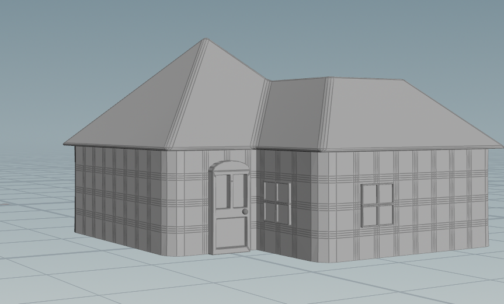
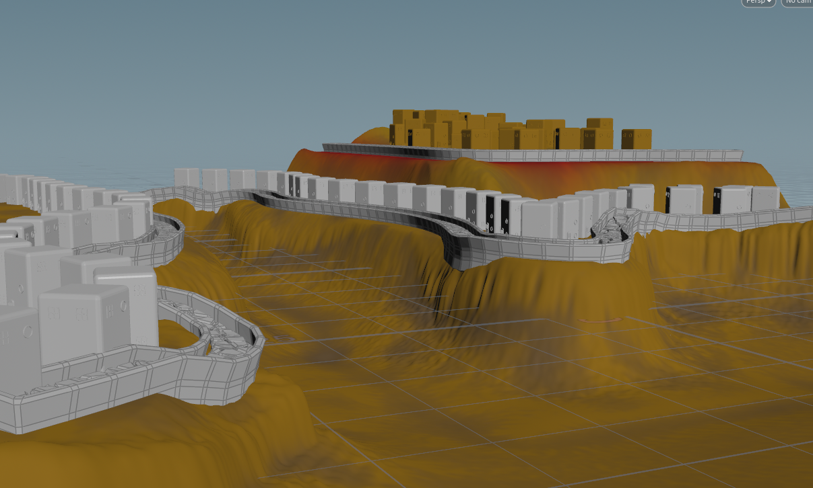

# Final Project!

This is it! The culmination of your procedural graphics experience this semester. For your final project, we'd like to give you the time and space to explore a topic of your choosing. You may choose any topic you please, so long as you vet the topic and scope with an instructor or TA. We've provided some suggestions below. The scope of your project should be roughly 1.5 homework assignments). To help structure your time, we're breaking down the project into 4 milestones:

## Project planning: Design Doc (due 11/9)
Before submitting your first milestone, _you must get your project idea and scope approved by Rachel, Adam or a TA._

### Design Doc
Start off by forking this repository. In your README, write a design doc to outline your project goals and implementation plan. It must include the following sections:

#### Introduction
- My final project revolves around recreating the city of Apotos from Sonic Unleashed in Houdini. The idea is to apply multiple concepts learned throughout the class such as noise functions, procedural geometry generation and city creation to achieve an aesthetically pleasing result.

#### Goal
- The goal of my project is to make an efficient procedural Apotos builder in Houdini using a combination of Procedural house generation with controls and procedural terrain. The idea is that the city should look organic so it should have also trees and plants, correct materials and the structure placement should follow a logic that makes sense in the real world. For example we expect to have house along the streets in the city.
- Ultimitely the objective with this project is not scale but actually have a couple of realistic looking blocks of the village that mimmic the style of the game really well.

#### Inspiration/reference:
- Images of Apotos in Sonic Unleashed (Game art and gameplay)

- Gameplay of the level

https://www.youtube.com/watch?v=j4OBe-rONR4

#### Specification:
- Procedural greek style houses. These will add different variations on window and door placement, roof adornments, color of windows. Varying modules will make up the total size based on the width, height and depth selected by the user.
- Procedural style mills with varying height.
- White stone material.
- User defined streets painted with the Path tool of Hudini.
- HDRI for sky downloaded online.
- Decorating assets placed procedurally such as barrels and bushes.
- Procedural terrain elevation.
- Procedural water base.

#### Techniques:
- First I'll start by building the house generator using this tutorial and changing the geometry to make it more greek looking:
https://www.youtube.com/watch?v=r0e7M2B7dL0&list=PLXNFA1EysfYnxvrW27g6e5HhTwKBM2TZC
- Then I'll generate wind mills following this tutorial
https://www.youtube.com/watch?v=afHVjiNeH7A&t=2s
- Then I will generate the Terrain using this tutorial as a reference:
https://www.youtube.com/watch?v=rwLbiuKX5D0
- I will generate the cobblestone paths using this tutorial:
https://www.youtube.com/watch?v=QH6Kk7_AJec
- I will make the base stone material white and change the color of the wood material.
- I will look for decorator assets online such as barrels, bushes and lamps that will be placed based on the previously referenced material.
- Will follow some of the tips here for material setup
https://www.youtube.com/watch?v=IcbzGNqnFkA

#### Design:

#### Timeline:
- (11/9)  Mileston 1 work: have the terrain generation, the house generator and the mill generator HDAs done.
- (11/16) Add some decorator such trees and barrels.
- (11/23) Milestone 2 work: have the houses realigned as well as mills. Avoid overlapping geometry. Add optimizations with any file caching as needed and setup camera for renders. Have the base layout of a couple of blocks of the village.
- (11/28) Final submission work: Download HDRIs and any missing material to prepare renders. Create renders.
- (12/5) Have the renders ready 

Submit your Design doc as usual via pull request against this repository.
## Milestone 1: Implementation part 1 (due 11/16)

* Added house generator: based on an extruded L system with random window types and door placement plus roof and no roof mode.

* Added procedural terrain: various types of noise and masks to get terrain

* Road generator: using voronoi noise and curve projections

* General state of things: I'm behind on the mill generator. The house generator took me longer than expected but I should have it ready for next milestone. Also haven't been able to  push houdini files yet because they are too heavy. Looking to solve that.

Begin implementing your engine! Don't worry too much about polish or parameter tuning -- this week is about getting together the bulk of your generator implemented. By the end of the week, even if your visuals are crude, the majority of your generator's functionality should be done.

Put all your code in your forked repository.

Submission: Add a new section to your README titled: Milestone #1, which should include
- written description of progress on your project goals. If you haven't hit all your goals, what's giving you trouble?
- Examples of your generators output so far
We'll check your repository for updates. No need to create a new pull request.
## Milestone 3: Implementation part 2 (due 11/28)

* Added more details to the road and adjusted form.
* Added procedural windmill created with L-Systems.
* Added Polyhaven sky hdri.
* Added more detail to the terrain.
* Added quixel megascans assets for materials in road, house concrete, windmill, grass, and cliffside.

* Added tree part.
* Since the file is too heavy for github I loaded it here to google drive https://drive.google.com/drive/folders/1ktqONZbyFW1bz0l2qw-rwIQqHJL6xMoR?usp=sharing.
* I'm still missing some materials and some assets like grass scattering.

We're over halfway there! This week should be about fixing bugs and extending the core of your generator. Make sure by the end of this week _your generator works and is feature complete._ Any core engine features that don't make it in this week should be cut! Don't worry if you haven't managed to exactly hit your goals. We're more interested in seeing proof of your development effort than knowing your planned everything perfectly. 

Put all your code in your forked repository.

Submission: Add a new section to your README titled: Milestone #3, which should include
- written description of progress on your project goals. If you haven't hit all your goals, what did you have to cut and why? 
- Detailed output from your generator, images, video, etc.
We'll check your repository for updates. No need to create a new pull request.

Come to class on the due date with a WORKING COPY of your project. We'll be spending time in class critiquing and reviewing your work so far.

## Final submission (due 12/5)

# Thigs I accomplished for this submission:

* Added textures and materials for all objects.
* Added Trees, Grass, and scattered rocks.
* Polished house placement.
* Did final render edited colors with post process effect.

# Final result render

# Post mortem

I believe my project went very well. I encountered some limitations in terms of hardware. For example I wanted more detailed grass and also have bodies of water but my laptop was not strong enough to handle it. So that made me make different choices. 
Also, having a set camera from the beginning allowed to cut back on a lot of geometry that would not end up in the frame. But, this also elminated my flexibility on composition in the end.
I believe this project was a great experience since I got to interact with a lot of different techniques and tools we used during the course such as: L-System, Procedural materials, Procedural geometry creation for villages/cities, Curved paramter, noise for terrain and element placement and more.
There are things I would like to expand on in the future, such as improving the scale of the city and adding more variation on the assets.

Time to polish! Spen this last week of your project using your generator to produce beautiful output. Add textures, tune parameters, play with colors, play with camera animation. Take the feedback from class critques and use it to take your project to the next level.

Submission:
- Push all your code / files to your repository
- Come to class ready to present your finished project
- Update your README with two sections 
  - final results with images and a live demo if possible
  - post mortem: how did your project go overall? Did you accomplish your goals? Did you have to pivot?

## Topic Suggestions

### Create a generator in Houdini

### A CLASSIC 4K DEMO
- In the spirit of the demo scene, create an animation that fits into a 4k executable that runs in real-time. Feel free to take inspiration from the many existing demos. Focus on efficiency and elegance in your implementation.
- Example: 
  - [cdak by Quite & orange](https://www.youtube.com/watch?v=RCh3Q08HMfs&list=PLA5E2FF8E143DA58C)

### A RE-IMPLEMENTATION
- Take an academic paper or other pre-existing project and implement it, or a portion of it.
- Examples:
  - [2D Wavefunction Collapse Pokémon Town](https://gurtd.github.io/566-final-project/)
  - [3D Wavefunction Collapse Dungeon Generator](https://github.com/whaoran0718/3dDungeonGeneration)
  - [Reaction Diffusion](https://github.com/charlesliwang/Reaction-Diffusion)
  - [WebGL Erosion](https://github.com/LanLou123/Webgl-Erosion)
  - [Particle Waterfall](https://github.com/chloele33/particle-waterfall)
  - [Voxelized Bread](https://github.com/ChiantiYZY/566-final)

### A FORGERY
Taking inspiration from a particular natural phenomenon or distinctive set of visuals, implement a detailed, procedural recreation of that aesthetic. This includes modeling, texturing and object placement within your scene. Does not need to be real-time. Focus on detail and visual accuracy in your implementation.
- Examples:
  - [The Shrines](https://github.com/byumjin/The-Shrines)
  - [Watercolor Shader](https://github.com/gracelgilbert/watercolor-stylization)
  - [Sunset Beach](https://github.com/HanmingZhang/homework-final)
  - [Sky Whales](https://github.com/WanruZhao/CIS566FinalProject)
  - [Snail](https://www.shadertoy.com/view/ld3Gz2)
  - [Journey](https://www.shadertoy.com/view/ldlcRf)
  - [Big Hero 6 Wormhole](https://2.bp.blogspot.com/-R-6AN2cWjwg/VTyIzIQSQfI/AAAAAAAABLA/GC0yzzz4wHw/s1600/big-hero-6-disneyscreencaps.com-10092.jpg)

### A GAME LEVEL
- Like generations of game makers before us, create a game which generates an navigable environment (eg. a roguelike dungeon, platforms) and some sort of goal or conflict (eg. enemy agents to avoid or items to collect). Aim to create an experience that will challenge players and vary noticeably in different playthroughs, whether that means procedural dungeon generation, careful resource management or an interesting AI model. Focus on designing a system that is capable of generating complex challenges and goals.
- Examples:
  - [Rhythm-based Mario Platformer](https://github.com/sgalban/platformer-gen-2D)
  - [Pokémon Ice Puzzle Generator](https://github.com/jwang5675/Ice-Puzzle-Generator)
  - [Abstract Exploratory Game](https://github.com/MauKMu/procedural-final-project)
  - [Tiny Wings](https://github.com/irovira/TinyWings)
  - Spore
  - Dwarf Fortress
  - Minecraft
  - Rogue

### AN ANIMATED ENVIRONMENT / MUSIC VISUALIZER
- Create an environment full of interactive procedural animation. The goal of this project is to create an environment that feels responsive and alive. Whether or not animations are musically-driven, sound should be an important component. Focus on user interactions, motion design and experimental interfaces.
- Examples:
  - [The Darkside](https://github.com/morganherrmann/thedarkside)
  - [Music Visualizer](https://yuruwang.github.io/MusicVisualizer/)
  - [Abstract Mesh Animation](https://github.com/mgriley/cis566_finalproj)
  - [Panoramical](https://www.youtube.com/watch?v=gBTTMNFXHTk)
  - [Bound](https://www.youtube.com/watch?v=aE37l6RvF-c)

### YOUR OWN PROPOSAL
- You are of course welcome to propose your own topic . Regardless of what you choose, you and your team must research your topic and relevant techniques and come up with a detailed plan of execution. You will meet with some subset of the procedural staff before starting implementation for approval.
