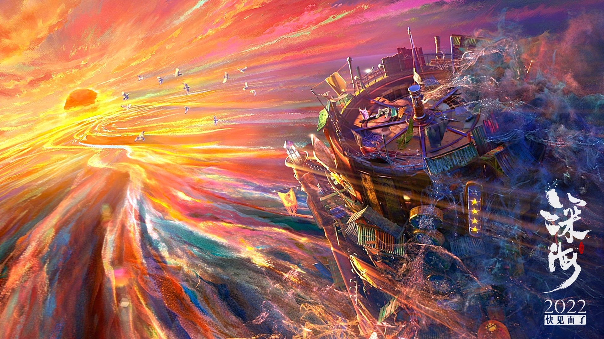
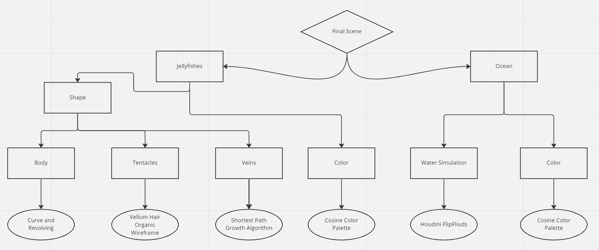

# Milestone 1 Progress
Project file: jellyfish-vein-fixed.hipnc
   
## Things achieved:
1. Procedurally modeled Jellyfish with Bell(head), tentacles, and veins.   
    * The bell is generated by revolving a curve, making modifying the shape very easy
    * The tantacles are procedurally generated along the border of the bell so different bell will have different tentacles. The density and length are also easy to modify.
    * The veins will also change depending on the bell shape. Some more work needs to be done in milestone 2 to make it easier to custimize the shape. 
    
2. Procedurally generated animation (by bending the bell curve and let the tentacles react to it)  
    * Currently it's repeating the same animation. Some randomness and custimization will be added in the future.   
   
3. Procedurally generated path (by marching a point along a curve and copy the jellyfish to that point)
    * This is high custimizable. By changing the curve (using a different deformation preset or hand draw), we can make the jellyfish move in any path.    
   

## Milestone Summary 1 and Milestone 2 Planning   
* I'm pretty close to what I planned to achieve for Milestone 1. The jellyfish generator has all the basic functions. Things to add and improve include:   
      1. Encapsulated modifiers for the shape attributes   
      2. Arms for the jellyfish (still debating wether it will make it look better)   
      3. Add more nodes for controlling the shape of the veins   
      4. Better shading techniques and tools   
* For milestone 2, I will finish a in-ocean simulator and improve my jellyfish generator. I will also try to make a simple but beautiful scene with multiple jellyfishes and ocean water tank.   
* I really need to thank Elyssa Chou! I could not have done this without her help!!   

# CIS 566 Final Project Design Doc
My project will be using Houdini to procedurally generate jellyfishes with colorful arms and tentacles in an ocean, and animate them. If time permits, I will create a short-story animation.   

#### Introduction
- What motivates your project?   
My original motivation is the cover art of <em>Madness</em> by Muse.    
   
I was intrigues by this jellyfish-like "creature" and thought it would be cool to procedurally generate this.   
Then I started imagining a jellyfish with these colorful strands as tentacles and arms, and had a story in mind.  
I know procedurally creating colorful jellyfishes with animations, making a visually-appealing in-ocean scene, and render a story with them will be a very ambitious project, but I hope that I'm able to finish as much as I can in this semester, and continue the work afterwards.   

#### Goal
- What do you intend to achieve with this project?  
  The goal is create visually appealing and stylelized jellyfish scenes. 
  1. Get more familiar with Houdini, master as many tools as I can.
  2. Learn more about colors and shapes, create absolutely beautiful jellyfishes, and grow myself as an artist.
  3. Learn more procedural techniques, try not to minimize things that need hand-tuning.

#### Inspiration/reference:
- You must have some form of reference material for your final project. Your reference may be a research paper, a blog post, some artwork, a video, another class at Penn, etc.  
  - Jellyfish   
    1. Shape: Real jellyfishes. I will be searching different jelly fish images online and visit aquariums.   
    2. Animation: [Live Jellyfish Cam](https://www.youtube.com/watch?v=pT9_HJr-nso) and real-life observation.
    3. Color: please see the <em>Madness</em> cover art above. I will also be talking to various artists about my final color palette selection. 
    4. Other: luckily, my mighty classmate [Elyssa Chou](https://github.com/e-chou) has experience with procedurally creating jellyfishes, and she is kind enough to teach me her techniques!   
    Here are some resources she had shared with me: 
        - [Bell and basic shape](https://www.youtube.com/watch?v=VyM6e4ga20M)
        - [Tentacles](https://www.youtube.com/watch?v=LN4XXaHQkmU)
        - [Veins](https://www.youtube.com/watch?v=3zL2oqZa-Oc)
  - Ocean
        
  
    1. Color: I want color of the ocean to be colorful as well. My reference is an animated movie (unreleased yet) called <em>Deep Sea</em>. Please see the ocean part of the [trailer](https://www.youtube.com/watch?v=Rjq9X2dfJm0). Above is an image of it:   
    2. Fluid Simulation: Since the scene is set inside an ocean, which is basically a giant water tank, I found this [tutorial](https://www.sidefx.com/tutorials/houdini-flip-tank-course-part-1-setting-up-flat-tank/) for fluid simulation in Houdini. 
      

  

#### Specification:
- Outline the main features of your project.
  1. Procedurally generated jellyfishes with procedural colors.
  2. Houdini jellyfish animations.
  3. Houdini water simulation.
- Extra (will start if I finish the above early or to be done post semester)
  1. Procedural ocean color
  2. Ink dissipation effect
  3. Short story animation   

#### Techniques:
- What are the main technical/algorithmic tools you’ll be using? Give an overview, citing specific papers/articles.   
  - The software for this project will be Houdini.    
  - The bell and the body of the jellyfish will be created by revolving a curve: [tutorial](https://www.youtube.com/watch?v=VyM6e4ga20M)   
  - The tentacles will be created using Vellum Hair Organic Wireframe: [tutorial](https://www.youtube.com/watch?v=LN4XXaHQkmU)   
  - The veins will be created using a shortest path growth algorithm: [tutorial](https://www.youtube.com/watch?v=3zL2oqZa-Oc)   
  - The ocean will be simulated using Houdini FlipFliuds: [tutorial](https://www.sidefx.com/tutorials/houdini-flip-tank-course-part-1-setting-up-flat-tank/)

#### Design:
- How will your program fit together? Make a simSSple free-body diagram illustrating the pieces.   
   

#### Timeline:
- Create a week-by-week set of milestones for each person in your group. Make sure you explicitly outline what each group member's duties will be.
    1. Milestone 1: Finish the basic structure of the jellyfish generator 
    2. Milestone 2: Refine the jellyfish generator and finish the in-ocean simulator
    3. Milestone 3: Create visually appealing scenes or add additional features.   
