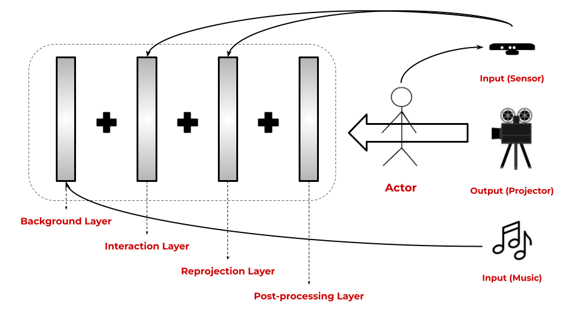

# Interactive Deep House Visualization

## Introduction

Generative art that are interactive is something I have always loved, especially since visiting large scale exhibitions by studios like [teamLab](https://www.teamlab.art/) and [Moment Factory](https://momentfactory.com/home). While the main purpose of computer graphics is to generate beautiful images, these visual experiences can be greatly elevated by integrating sensors and input systems to involve the audience in the art form. Recently, I have been playing around with [TouchDesigner](https://derivative.ca/) and the LeapMotion controller to create interactive art using hand motions. However, these experiences are thus far limiting in space. It is now time for me scale it to the next level both in terms of display output and the input system.

The theme of this project focuses on two important interests of mine: **dancing** and **fashion**. I recently discovered the music genre of **Deep House**, which is both a type of [dance](https://www.youtube.com/watch?v=PbSv9doE9IY&ab_channel=MOVEDanceStudio) as well as the genre heavily used in the fashion industry for fashion runways or stores like ZARA. For example, [check this song out](https://www.youtube.com/watch?v=KD3sOUxKp9g&ab_channel=MelomaniacRDV) to get a sense of the vibe. My plan is to integrate these two elements into my work as I design the overall audience experience and the visuals.

## Goal

The goal of this project is to create an audio-and-motion-reactive visualization of Deep House music. Specifically, there are a few core objectives that I would like to meet:

* The visuals react to a playlist of Deep House music coherently. The overall mood established should follow the beats and pace of the music.
* The project will be rendered in real-time at an interactive rate (minimum 30 fps).
* The audience can interact with the visualizer by moving their bodies and dancing to the music.
* The project can be scaled to a larger environment, ideally displayed using a projector and have multiple people interact with it at the same time.
* The visuals must be polished with fine-tuned color schemes that feel in place with the overall theme of the project.
* BONUS: Install the project somewhere on campus for people to actually interact with, and record a video showing this.

**The above goals are dependent on my ability to source the hardware.*

## Inspiration & References

- [TouchDesigner Artist: Bileam Tschepe](https://www.instagram.com/elekktronaut/) - he has lots of cool patterns created in TouchDesigner that would go well with Deep House.
- [Universe of Water Particles - teamLab](https://www.teamlab.art/ew/waterparticles-transcending_superblue/superbluemiami/) - one of my favorite pieces from teamLab. Love the use of lines as waterfall. The color contrast between the waterfall and the flowers also works very well.
- [TouchDesigner: Popping Dance w/ Particles](https://www.youtube.com/watch?v=oSPbZISVjRM) - an example of the type of interactivity that's possible with TouchDesigner.
- [TouchDesigner: Audio-Reactive Voronoi](https://www.youtube.com/watch?v=tQp2osjgfYE&ab_channel=VJHellstoneLiveVisuals) - the type of background visuals that would be good for this project. Nothing too complex.
- [Taipei Fashion Week SS22 - Ultra Combos (Only available in Chinese)](https://ultracombos.com/SS22-Taipei-Fashion-Week-SS22) - love the aesthetics of the background for this fashion show. 

## Specification

This project will be implemented using **TouchDesigner** simplifying technical implementations. The inputs to the system will be a depth sensor camera such as ZED Mini or Kinect, as well as audio signals from the music. These signals will be used to drive the various parameters of the visualization.

The visualizer can be broken down into multiple visual layers which are composited together. Specifically there are four layers that are included in the project:

1. **Background Layer**: this layer will be the background for the final render. It will include procedurally generated patterns that are relatively simple, such that they do not overpower the foreground elements. These patterns will be **audio-reactive**.

2. **Interaction Layer**: this layer will contain procedural elements that are **motion-reactive** thus making it interactive. For example, a particle system can be included that are reactive to the motion of the audience. This should be the primary focus of the art for the audience.

3. **Reprojection Layer (Stretch Goal)**: this layer is optional and will only be implemented if time permits. It will contain a stylized reprojection of the actor. This layer allows a clearer indication of where the actors are. This reprojection layer can be **audio-reactive**.

4. **Post-processing Layer**: this layer is for enhancing the visuals by applying post-processing effects to the previous layers. This layer is crucial in achieving the desired look, feel and mood.

Finally, the composited render will be displayed using a projector.

## Techniques

The project will explore many common procedural techniques, including but not limited to the following:

* **Particles Simulation** - particle systems will be used to add interactivity to the scene, and/or as an decorative element. These systems will be driven by custom forces that are guided by noise functions and input signals. The GPU-based particle systems will be used in TouchDesigner in order to meet the real-time requirement.
* **Procedural Patterns** - procedural patterns will be generated using noise and toolbox functions along with basic geometric shapes. The idea is to generate a simple audio-reactive background that complements the main interactive layer.
* **Optical Flow** - optical flow is a common technique used in TouchDesigner with a camera to affect the image output. The motion between frames captured from the camera will be converted to velocity signals that can drive other parameters in the scene.
* **Noise and Toolbox Functions will be used everywhere!**
* **Post-processing Techniques** - bloom effect, blur, feedback, distortion and edge detection will be experimented with to enhance the visuals.
* **Coloring** - a specific color palette will be selected that best describes the theme of the project. This is all about making it look pretty!

## Design

## Timeline

### Week 1 (11/09-11/16)
* Establish the color tone
* Curate the playlist to go with the visualizer
* Source the required hardware
* Create a simple audio-reactive pattern for the background layer
* Create a simple motion-reactive visual using the webcam for the interaction layer

### Week 2 (11/16-11/23)
* Fine tune the shape for the background layer
* Connect the depth sensor to the interaction layer and finalize the experience
* Add in post-processing layer

*(Will not be working from 11/23-11/28)*

### Week 3 (11/28-12/05)
* If time permitting, implement a simple reprojection layer
* Color grading and parameters tuning
* Install the project somewhere on campus
