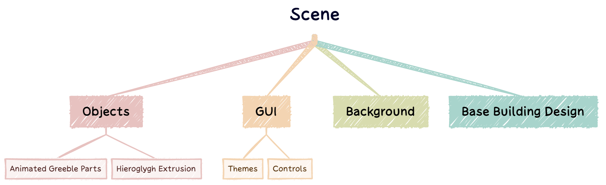
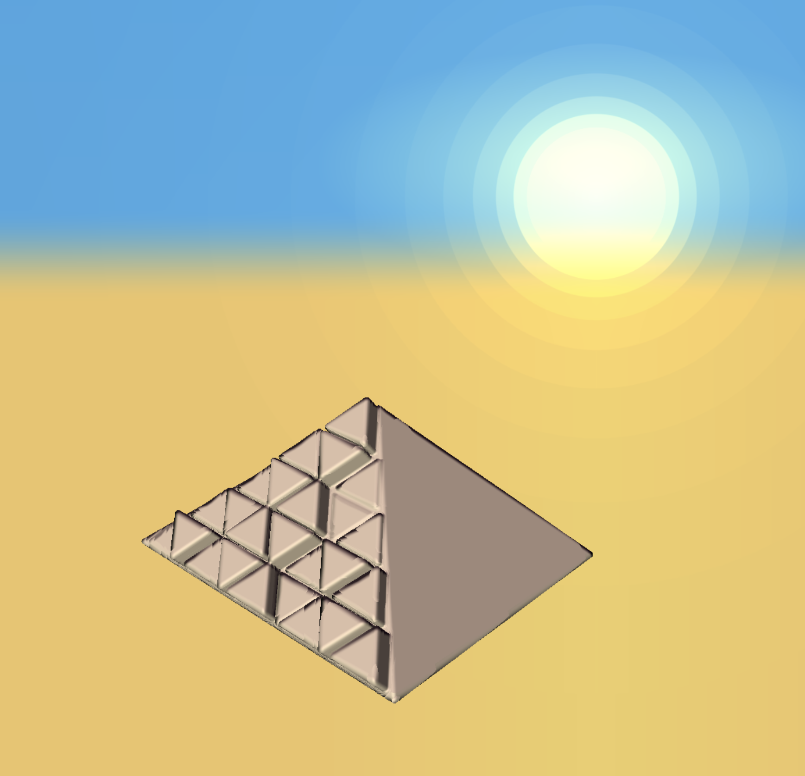

# Greeble Generator based on WebGL

Team: San Jewell and Yilin Liu

- [Video Demo](https://clipchamp.com/watch/Pm6bPs0cFJ6)

- [Live Demo](https://cis566-greeble-pyramid.netlify.app/)

## Final submission (due 12/5)
|
|:-------:|
Greeble Extrution Variations

|
|:-------:|
Various Rows & Columns 

We implemented a SDF-based greeble pyramid generator using WebGL. We handcrafted SDF for symbols 

|
|:-------:|
 UI Options: In "Greeble Control" folder, users can tweak parameters to adjust the greeble generations. In "Animation" folder, users can animate the camera to automatically pan around the pyramid.

| Symbol       | Image |
| ----------- | ----------- |
| Cross Symbol |        |
| Flake Symbol  |        |
| Line Symbol  |        |
| Circle Symbol  |        |
   

Time to polish! Spen this last week of your project using your generator to produce beautiful output. Add textures, tune parameters, play with colors, play with camera animation. Take the feedback from class critques and use it to take your project to the next level.

Submission:
- Push all your code / files to your repository
- Come to class ready to present your finished project
- Update your README with two sections 
  - final results with images and a live demo if possible
  - post mortem: how did your project go overall? Did you accomplish your goals? Did you have to pivot?

## Design Doc

### Introduction
- I have always been interested in the lore, theocracy, language, and most importantly distinctive artic style of the civilization that thrived on the banks of the Nile Millenia ago: Ancient Egypt. I had a few ideas of how I might apply my interest in this theme in the realm of proceduralism. 

### Goal
- Design a greeble generator both:
 
	1) designed to work well on a few specific types of themed structure geometry. 
	2) consisting themselves at least partially of recognizable Egyptian themes. 

### Inspiration/reference:
- In reference to goal #1, these will probably have minimal or no procedural elements. Perhaps a few different base dimensions or heights, or if short on time, the buildings will be completely hand defined. Their shapes are usually relatively simple to model. See a few examples of common structures in this image. In the scope of this project I would probably start with the obelisk or pyramid shapes, possible exploring the larger temple styles if time permits.

- The main goal is #2, that is, generating greebles to fit properly and look pleasant on the surfaces of these structures. I found a few inspiration images for this technique online. The first demonstrates height based greebles divided into a triangle mesh. The second demonstrates the possibility for building lighting on a themed structure.

| Reference 1      | Reference 2 |
| ----------- | ----------- |
|       |        |
        

### Specification:
- For greebles
  - be able to select a surface partition type, square or triangle? 
  - be able to select a scale for the "noise"
  - be able to select some kind of mix ratio between generic geometric shapes (i.e. "star wars" greebles) and themed shapes, such as extruded hieroglyphs
- For structures
  - be able to choose from one or more pre-defined stereotypical building styles
  - (time permitting) be able to apply some kind of noise to generate variants of the chosen building shape

### Techniques:
- [Procedural Greeble Tutorial](https://lindenreidblog.com/2017/12/13/procedural-greeble-tutorial/) by [Linden Reid](https://lindenreidblog.com/)

In this tutorial, Linden introduces how he did the greeble effects. Put simply, to extrude a poly, we can create new verticies by translating the old verticies in the direction of the surface normal. 

For more realistic effects, we can add randomness to the extrusion scale and whether or not greeble is applied. 

- [Voronoi Greeble Displacement: ShaderToy](https://www.shadertoy.com/view/NllyWf) by Shane

In this shadertoy, Shane used a tailored Voronoi algorithm to drive the generation of greeble displacement.  

### Design:

The scene will consist of two main component, a background scene and a foreground geometry powered by greeble.

### Timeline:

|  | San Jewell | Yilin Liu |
| --------------- | --------------- | --------------- |
| Milestone 1, 11/16| General Greeble Generation & Initial structure design | General Greeble Generation & Initial structure design |
| Milestone 2, 11/28| Second level of symbol theming, GUI options | Procedural Background, GUI options |
| Milestone 3, 12/5 | Optimization & Demo Scene Design | Documentation write-up & Demo Scene Design |

Submit your Design doc as usual via pull request against this repository.

## Milestone 1: Implementation part 1 (due 11/16)

For Milestone1, we worked on a tesselation-based method to divide our pyramid but did not hit the goals. Therefore, we recently switched to the SDF-based method, which is more intuitive.
### DONE
- Implemented the extrusion through a SDF-based method. 
- Procedural sky with sun

### In Progress 
- The greeble Algorithm

### Screenshot

## Milestone 2: Implementation part 2 (due 11/28)

### DONE

- The greeble algorithm. 

### In Progress 

- GUI options
- Better visuals  

### Screenshot

